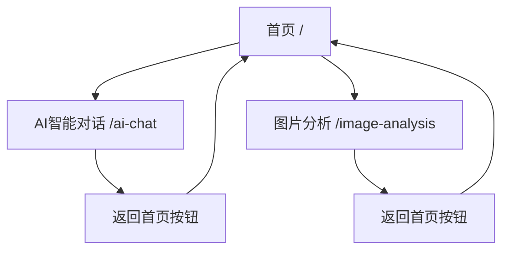

# 前端多路由系统重构总结

## 重构目标
将原来的单页面应用重构为多路由系统，拆分为首页、AI聊天页面和图片分析页面，提升用户体验和代码可维护性。

## 重构后的文件结构

```
src/
├── 📄 App.tsx (主应用入口，配置路由)
├── 📄 main.tsx (应用启动文件)
├── 📁 pages/ (页面组件目录)
│   ├── HomePage.tsx (首页 - 功能选择)
│   ├── AiChatPage.tsx (AI智能对话页面)
│   ├── ImageAnalysisPage.tsx (图片分析页面)
│   └── ImageAnalysisPage.module.scss (图片分析页面样式)
├── 📁 components/ (组件目录)
│   └── common/
│       └── BackButton.tsx (返回首页按钮组件)
├── 📁 router/ (路由配置)
│   └── index.tsx (React Router 配置)
└── 📁 assets/ (静态资源)
```

## 路由设计

### 路由映射表

| 路径 | 组件 | 功能描述 |
|------|------|----------|
| `/` | `HomePage` | 首页，包含两个功能入口按钮 |
| `/ai-chat` | `AiChatPage` | AI智能对话功能 |
| `/image-analysis` | `ImageAnalysisPage` | 多图片关系分析功能 |
| `/*` | `HomePage` | 404重定向到首页 |

### 导航流程



## 页面功能详情

### 🏠 首页 (HomePage)
- **设计风格**: 现代渐变背景，卡片式布局
- **主要功能**: 
  - 展示两个主要功能模块
  - 提供清晰的功能入口
  - 响应式设计，适配不同屏幕
- **交互元素**: 
  - AI智能对话入口按钮
  - 图片分析入口按钮
  - 悬停效果和动画

### 💬 AI智能对话页面 (AiChatPage)
- **核心功能**:
  - 实时聊天对话
  - 支持流式响应和普通响应模式
  - 自定义系统提示词
  - 聊天记录管理（复制、下载、清除）
- **交互特性**:
  - Shift+Enter换行，Enter发送
  - 消息气泡式显示
  - 时间戳显示
  - 固定在顶部的返回按钮

### 🖼️ 图片分析页面 (ImageAnalysisPage)
- **核心功能**:
  - 多图片上传（最多10张）
  - 三种分析模式：关系分析、对比分析、时序分析
  - 拖拽上传支持
  - 分析结果展示和导出
- **用户体验**:
  - 文件类型和大小验证
  - 上传进度反馈
  - 可折叠的详细结果显示
  - 固定在顶部的返回按钮

## 🔄 公共组件

### BackButton 组件
- **位置**: 固定在页面左上角
- **样式**: 半透明背景，主色调按钮
- **功能**: 一键返回首页
- **可配置**: 支持自定义返回路径和按钮文本

## 🎨 设计特点

### 视觉设计
- **首页**: 渐变背景 + 卡片式布局
- **功能页**: 简洁的灰色背景 + 白色卡片
- **统一的色彩方案**: 蓝色（AI聊天）+ 绿色（图片分析）
- **响应式设计**: 适配桌面和移动设备

### 用户体验
- **导航简单**: 清晰的功能分类和返回机制
- **交互流畅**: 按钮悬停效果和加载状态
- **信息层次**: 合理的信息架构和视觉层次
- **错误处理**: 友好的错误提示和异常处理

## 🛠️ 技术实现

### 依赖包
- `react-router-dom`: 前端路由管理
- `antd`: UI组件库
- `sass`: CSS预处理器

### 关键特性
- **路由懒加载**: 支持代码分割优化
- **TypeScript**: 完整的类型支持
- **模块化设计**: 组件和页面分离
- **状态管理**: 各页面独立状态管理

## ✅ 重构成果

### 代码质量提升
- **模块化**: 功能按页面分离，职责明确
- **可维护性**: 单一功能页面，修改影响范围小
- **可扩展性**: 新增功能只需添加新页面和路由
- **代码复用**: 公共组件可在多个页面使用

### 用户体验优化
- **功能划分**: 用户可快速找到需要的功能
- **导航便捷**: 始终可以快速返回首页
- **视觉统一**: 一致的设计语言和交互模式
- **性能优化**: 按需加载页面内容

### 开发体验改善
- **开发效率**: 各功能模块独立开发和测试
- **团队协作**: 不同开发者可并行开发不同页面
- **调试方便**: 问题定位更精确
- **部署灵活**: 支持渐进式功能发布

## 🚀 验证结果

- ✅ 前端服务正常启动（http://localhost:5173）
- ✅ 路由跳转功能正常
- ✅ 所有页面功能完整
- ✅ 返回按钮正常工作
- ✅ 无TypeScript和ESLint错误

重构后的前端系统具有更好的用户体验、更清晰的代码结构和更强的可维护性！
